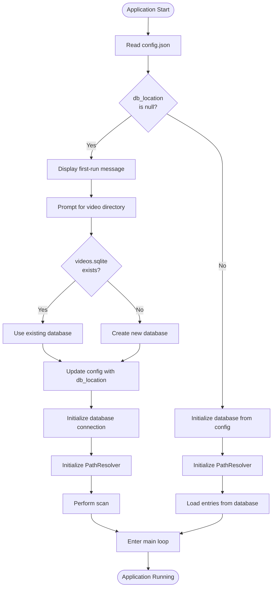
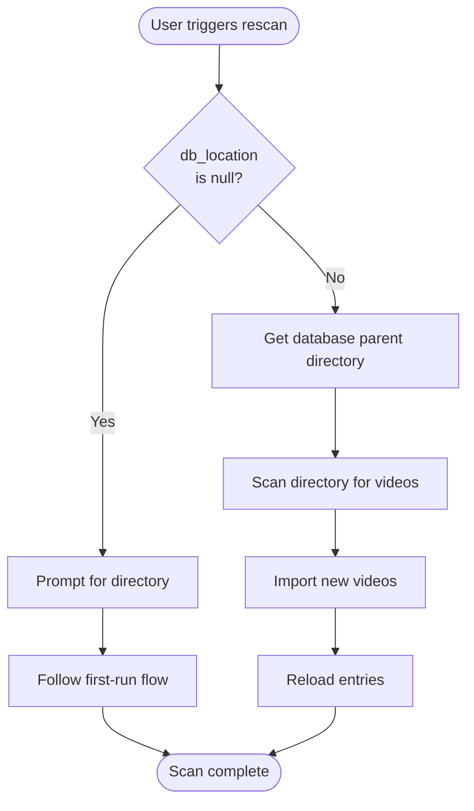
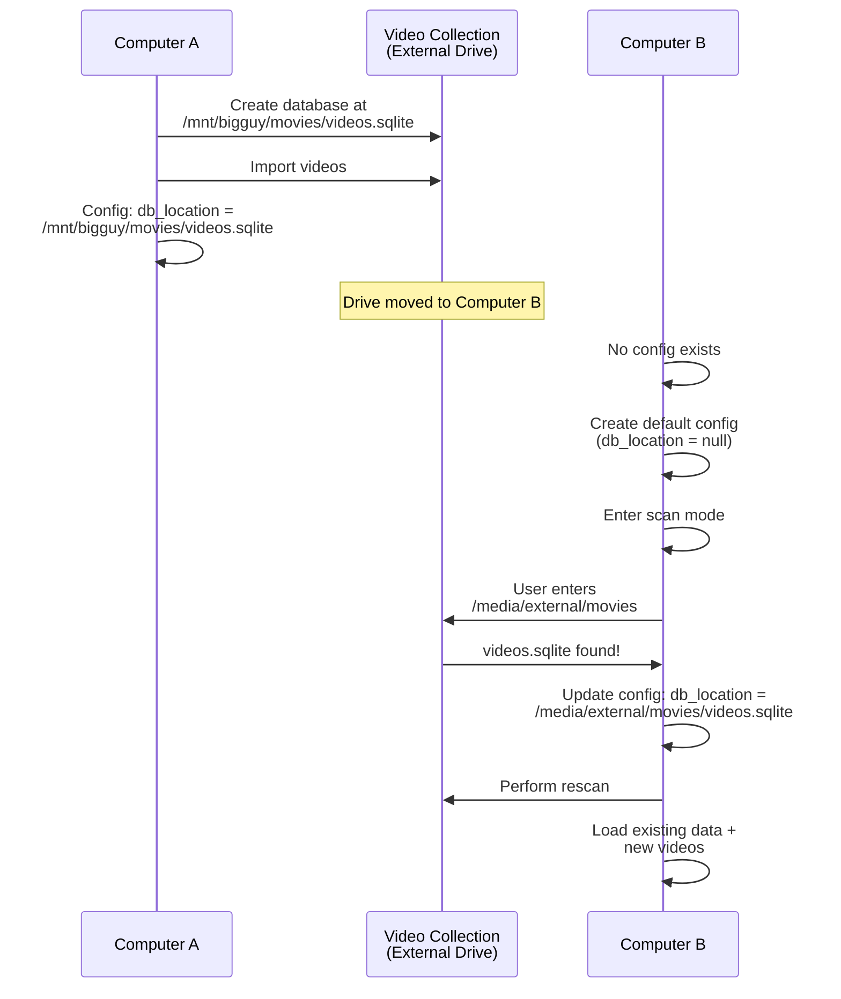

# Design Document

## Overview

This design document outlines the architectural changes needed to implement database and configuration portability. The redesign moves the database from a fixed application data directory to the video collection directory, while maintaining the configuration file in a platform-standard location. This approach makes the system more portable across different computers and mount points while reducing configuration fragility.

## Architecture

### Current Architecture

The current system has the following characteristics:

- **Config File**: Located at `~/.config/movies/config.json` (via `directories` crate)
- **Database**: Located at `~/.local/share/movies/videos.sqlite` (via `directories` crate)
- **Config Parameters**: `root_dir` (optional root for path resolution) and `path` (relative path to scan)
- **Path Resolution**: `PathResolver` uses `root_dir` to resolve relative paths stored in the database

**Problems with Current Architecture:**
1. Database and videos are in separate locations
2. Moving videos requires updating both `root_dir` and potentially the database
3. `root_dir` and `path` parameters are confusing
4. Database is not portable with the video collection

### New Architecture

The new system will have these characteristics:

- **Config File**: Located at `~/.config/movies/config.json` (unchanged location)
- **Database**: Located at `{video_collection_dir}/videos.sqlite` (alongside videos)
- **Config Parameters**: Single `db_location` parameter pointing to the database file
- **Path Resolution**: `PathResolver` derives root from database location's parent directory

**Benefits of New Architecture:**
1. Database travels with video collection
2. Single configuration parameter (`db_location`) is intuitive
3. Changing `db_location` switches collections without breaking anything
4. Easy to use same collection from different computers with different mount points

## Components and Interfaces

### 1. Config Module (`src/config.rs`)

**Changes Required:**

```rust
#[derive(Deserialize, Serialize)]
pub struct Config {
    pub db_location: Option<String>,  // NEW: Path to videos.sqlite
    // Remove: root_dir, path
    
    // Preserve existing display and player settings
    pub current_fg: String,
    pub current_bg: String,
    pub dirty_fg: String,
    pub dirty_bg: String,
    pub video_extensions: Vec<String>,
    pub video_player: String,
}
```

**New Methods:**

- `get_database_path() -> Option<PathBuf>`: Returns the database path if configured
- `set_database_path(path: PathBuf)`: Updates `db_location` and saves config
- `is_first_run() -> bool`: Returns true if `db_location` is null

**Migration Strategy:**

The `read_config` function should handle migration from old config format:
- If old config has `root_dir` but no `db_location`, attempt to find `videos.sqlite` in `root_dir`
- If found, set `db_location` to that path
- If not found, set `db_location` to null (requires user to scan)

### 2. PathResolver Module (`src/path_resolver.rs`)

**Changes Required:**

The `PathResolver` currently takes an optional `root_dir` from config. It needs to be refactored to derive the root from the database location.

**New Constructor:**

```rust
impl PathResolver {
    /// Create a new PathResolver from database location
    /// 
    /// # Arguments
    /// * `db_path` - Path to the videos.sqlite database file
    /// 
    /// # Returns
    /// * `Result<Self, PathResolverError>` - New PathResolver or error
    pub fn from_database_path(db_path: &Path) -> Result<Self, PathResolverError> {
        // Validate database path exists
        if !db_path.exists() {
            return Err(PathResolverError::DatabaseNotFound(db_path.to_path_buf()));
        }
        
        // Get parent directory as root
        let root_dir = db_path.parent()
            .ok_or(PathResolverError::InvalidDatabasePath(db_path.to_path_buf()))?
            .to_path_buf();
        
        // Canonicalize to resolve symlinks
        let canonical_root = root_dir.canonicalize()
            .map_err(PathResolverError::IoError)?;
        
        Ok(PathResolver {
            root_dir: canonical_root,
        })
    }
}
```

**New Error Types:**

```rust
pub enum PathResolverError {
    // Existing errors...
    DatabaseNotFound(PathBuf),
    InvalidDatabasePath(PathBuf),
}
```

**Unchanged Methods:**

The following methods remain unchanged as they already work with the `root_dir` field:
- `to_relative(&self, absolute_path: &Path)`
- `to_absolute(&self, relative_path: &Path)`
- `validate_path_under_root(&self, path: &Path)`

**Removed Methods:**

- `resolve_config_path()` - No longer needed since config doesn't have a `path` parameter

### 3. Database Module (`src/database.rs`)

**Changes Required:**

**Database Initialization:**

Currently, the database is initialized via `lazy_static` which creates the database immediately. This needs to be changed to support delayed initialization.

**New Approach:**

```rust
// Remove lazy_static initialization
// Add explicit initialization function

static DB_CONN: OnceLock<Mutex<Connection>> = OnceLock::new();

pub fn initialize_database(db_path: &Path) -> Result<(), Box<dyn std::error::Error>> {
    // Create parent directory if it doesn't exist
    if let Some(parent) = db_path.parent() {
        std::fs::create_dir_all(parent)?;
    }
    
    // Open or create database
    let conn = Connection::open(db_path)?;
    
    // Initialize schema (existing table creation code)
    conn.execute("CREATE TABLE IF NOT EXISTS series (...)", [])?;
    conn.execute("CREATE TABLE IF NOT EXISTS season (...)", [])?;
    conn.execute("CREATE TABLE IF NOT EXISTS episode (...)", [])?;
    
    // Data cleanup operations (existing cleanup code)
    // ...
    
    // Store connection in OnceLock
    DB_CONN.set(Mutex::new(conn))
        .map_err(|_| "Database already initialized")?;
    
    Ok(())
}

pub fn get_connection() -> &'static Mutex<Connection> {
    DB_CONN.get().expect("Database not initialized")
}
```

**Update All Database Functions:**

Replace `DB_CONN.lock()` with `get_connection().lock()` throughout the module.

**Removed Functions:**

- `set_database_path()` - No longer needed with new initialization approach

### 4. Main Module (`src/main.rs`)

**Changes Required:**

The main function needs significant refactoring to handle the new initialization flow.

**New Initialization Flow:**

```rust
fn main() -> io::Result<()> {
    // 1. Initialize application paths (config directory only)
    let app_paths = AppPaths::new()?;
    
    // 2. Read config
    let mut config = read_config(&app_paths.config_file);
    
    // 3. Check if first run (db_location is null)
    if config.db_location.is_none() {
        // First run - enter scan mode immediately
        // Database will be created during scan
        initialize_terminal()?;
        let result = first_run_flow(&mut config, &app_paths.config_file);
        restore_terminal()?;
        return result;
    }
    
    // 4. Initialize database from config
    let db_path = PathBuf::from(config.db_location.as_ref().unwrap());
    database::initialize_database(&db_path)?;
    
    // 5. Initialize PathResolver from database location
    let resolver = PathResolver::from_database_path(&db_path)?;
    
    // 6. Load entries and start main loop
    let entries = get_entries()?;
    initialize_terminal()?;
    let result = main_loop(entries, config, resolver);
    restore_terminal()?;
    result
}
```

**New Function: first_run_flow**

```rust
fn first_run_flow(config: &mut Config, config_path: &Path) -> io::Result<()> {
    // Display welcome message
    // Prompt user for video collection directory
    // Check if videos.sqlite exists in that directory
    // If exists: use existing database
    // If not: create new database
    // Update config with db_location
    // Initialize database and PathResolver
    // Perform initial scan
    // Enter main loop
}
```

### 5. Handlers Module (`src/handlers.rs`)

**Changes Required:**

**Rescan Logic (CTRL+L):**

Currently, the rescan logic prompts for a directory. This needs to be changed:

```rust
// Old behavior: Always prompt for directory
// New behavior: 
//   - If db_location is null: prompt for directory (first-time setup)
//   - If db_location is set: automatically rescan database's parent directory

pub fn handle_rescan(
    config: &Config,
    resolver: &PathResolver,
    entries: &mut Vec<Entry>,
    filtered_entries: &mut Vec<Entry>,
) {
    if config.db_location.is_none() {
        // First-time setup - prompt for directory
        // (This should rarely happen as first_run_flow handles it)
        prompt_for_directory_and_scan(config, entries, filtered_entries);
    } else {
        // Normal rescan - use database's parent directory
        let scan_dir = resolver.get_root_dir();
        scan_directory(scan_dir, resolver, entries, filtered_entries);
    }
}
```

**Entry Mode:**

The Entry mode currently allows users to enter a path to scan. This needs to be updated to handle the first-run scenario:

```rust
pub fn handle_entry_mode(
    // ... parameters ...
) {
    // When user presses Enter:
    // 1. Check if videos.sqlite exists in entered directory
    // 2. If exists:
    //    - Initialize database from existing file
    //    - Update config with db_location
    //    - Initialize PathResolver
    //    - Perform rescan to pick up new videos
    // 3. If not exists:
    //    - Create new database in that directory
    //    - Update config with db_location
    //    - Initialize PathResolver
    //    - Perform initial scan
    // 4. Switch to Browse mode
}
```

### 6. Paths Module (`src/paths.rs`)

**Changes Required:**

The `AppPaths` struct currently manages both config and database paths. Since the database location is now dynamic, this needs to be simplified:

```rust
pub struct AppPaths {
    pub config_file: PathBuf,
    // Remove: database_file
}

impl AppPaths {
    pub fn new() -> Result<Self, String> {
        let proj_dirs = ProjectDirs::from("", "", "movies")
            .ok_or("Failed to determine application directories")?;
        
        let config_dir = proj_dirs.config_dir();
        
        // Create config directory if it doesn't exist
        std::fs::create_dir_all(config_dir)
            .map_err(|e| format!("Failed to create config directory {}: {}", 
                config_dir.display(), e))?;
        
        Ok(AppPaths {
            config_file: config_dir.join("config.json"),
        })
    }
}
```

## Data Models

### Config File Format

**Old Format:**
```json
{
  "root_dir": "/mnt/bigguy/movies",
  "path": ".",
  "current_fg": "Black",
  "current_bg": "White",
  "dirty_fg": "Black",
  "dirty_bg": "White",
  "video_extensions": ["mp4", "mkv", "avi", "mov", "flv", "wmv", "webm"],
  "video_player": "/usr/bin/vlc"
}
```

**New Format:**
```json
{
  "db_location": "/mnt/bigguy/movies/videos.sqlite",
  "current_fg": "Black",
  "current_bg": "White",
  "dirty_fg": "Black",
  "dirty_bg": "White",
  "video_extensions": ["mp4", "mkv", "avi", "mov", "flv", "wmv", "webm"],
  "video_player": "/usr/bin/vlc"
}
```

**First-Run Format:**
```json
{
  "db_location": null,
  "current_fg": "Black",
  "current_bg": "White",
  "dirty_fg": "Black",
  "dirty_bg": "White",
  "video_extensions": ["mp4", "mkv", "avi", "mov", "flv", "wmv", "webm"],
  "video_player": "/usr/bin/vlc"
}
```

### Database Schema

No changes to the database schema are required. The database continues to store relative paths in the `episode.location` field.

## Error Handling

### New Error Scenarios

1. **Database Not Found**: When `db_location` points to a non-existent file
   - **Handling**: Display error message, prompt user to scan or update config

2. **Database Parent Directory Not Accessible**: When database's parent directory doesn't exist or isn't readable
   - **Handling**: Display error message, exit gracefully

3. **Config Migration Failure**: When migrating from old config format fails
   - **Handling**: Log warning, treat as first-run scenario

4. **Database Initialization Failure**: When creating new database fails
   - **Handling**: Display error message with specific reason (permissions, disk space, etc.)

### Error Messages

- **First Run**: "Welcome! Please enter the path to your video collection directory to get started."
- **Database Not Found**: "Error: Database not found at {path}. Please run a scan to set up your collection."
- **Invalid Database Path**: "Error: Invalid database path: {path}. Please check your config file."
- **Scan Success (New DB)**: "Created new database and imported {count} videos."
- **Scan Success (Existing DB)**: "Connected to existing database. Found {new_count} new videos."

## Testing Strategy

### Unit Tests

1. **Config Module Tests**
   - Test config serialization/deserialization with new format
   - Test migration from old config format
   - Test first-run config creation
   - Test `get_database_path()` and `set_database_path()` methods

2. **PathResolver Module Tests**
   - Test `from_database_path()` with valid database path
   - Test error handling for non-existent database
   - Test error handling for database without parent directory
   - Test that existing path resolution methods work with new constructor

3. **Database Module Tests**
   - Test `initialize_database()` creates database and schema
   - Test `initialize_database()` works with existing database
   - Test error handling for invalid paths
   - Test that database operations work after initialization

### Integration Tests

1. **First-Run Scenario**
   - Start with no config file
   - Verify config is created with `db_location: null`
   - Enter scan mode and provide directory
   - Verify database is created in that directory
   - Verify config is updated with correct `db_location`
   - Verify videos are imported

2. **Existing Database Scenario**
   - Start with no config file
   - Enter scan mode and provide directory with existing `videos.sqlite`
   - Verify existing database is used
   - Verify config is updated with correct `db_location`
   - Verify existing data is preserved
   - Verify new videos are added

3. **Rescan Scenario**
   - Start with valid config and database
   - Trigger rescan (CTRL+L)
   - Verify no directory prompt appears
   - Verify database's parent directory is scanned
   - Verify new videos are added

4. **Multi-Computer Scenario**
   - Create database on Computer A at `/mnt/bigguy/movies/videos.sqlite`
   - Copy video collection to Computer B at `/media/external/movies/`
   - Start app on Computer B (no config)
   - Enter scan mode and provide `/media/external/movies`
   - Verify existing database is detected and used
   - Verify config is created with correct path for Computer B
   - Verify all existing data is accessible

### Manual Testing Checklist

- [ ] First run on clean system
- [ ] Scan with new database creation
- [ ] Scan with existing database detection
- [ ] Rescan after initial setup
- [ ] Config migration from old format
- [ ] Error handling for invalid paths
- [ ] Error handling for permission issues
- [ ] Multi-computer portability
- [ ] Database and videos moved together
- [ ] Config updated to point to moved database

## Implementation Notes

### Migration Path for Existing Users

For users with existing installations:

1. **Automatic Migration**: When the app detects old config format:
   - Look for `videos.sqlite` in `~/.local/share/movies/` (old location)
   - If found, display message: "Migrating to new database location..."
   - Copy database to `{root_dir}/videos.sqlite`
   - Update config with new `db_location`
   - Delete old database file

2. **Manual Migration**: Users can manually:
   - Copy `videos.sqlite` to their video collection directory
   - Update config file with new `db_location`
   - Restart application

### Backward Compatibility

The new system is not backward compatible with the old config format. However, the migration logic in `read_config()` will handle the transition automatically for most users.

### Performance Considerations

- Database initialization is now explicit rather than lazy, which may slightly increase startup time
- Path resolution performance is unchanged
- Scan performance is unchanged

### Security Considerations

- Validate that `db_location` points to a file within a reasonable scope (not system directories)
- Ensure database file permissions are set correctly (user read/write only)
- Validate user input for directory paths during scan to prevent path traversal attacks

## Diagrams

### Application Startup Flow



### Rescan Flow



### Multi-Computer Usage



## Design Decisions and Rationales

### Decision 1: Database Location

**Decision**: Store database in video collection directory rather than application data directory.

**Rationale**:
- Keeps database and videos together for easy backup/movement
- Makes the relationship between database and videos explicit
- Simplifies multi-computer usage

**Alternatives Considered**:
- Keep database in app data directory: Rejected because it doesn't solve portability issues
- Store database path in environment variable: Rejected because it's less user-friendly than config file

### Decision 2: Single Configuration Parameter

**Decision**: Replace `root_dir` and `path` with single `db_location` parameter.

**Rationale**:
- Simpler mental model for users
- Reduces configuration errors
- Makes the purpose of the parameter obvious
- Changing `db_location` switches collections cleanly

**Alternatives Considered**:
- Keep both parameters: Rejected because it maintains existing confusion
- Add `db_location` alongside existing parameters: Rejected because it increases complexity

### Decision 3: Delayed Database Initialization

**Decision**: Don't create database until first scan.

**Rationale**:
- Allows user to choose where database is created
- Prevents creating empty database in wrong location
- Makes first-run experience more intentional

**Alternatives Considered**:
- Create database immediately in default location: Rejected because it doesn't support user choice
- Prompt for location before any UI: Rejected because it's less user-friendly

### Decision 4: Automatic Rescan After Setup

**Decision**: Automatically rescan when connecting to existing database.

**Rationale**:
- Ensures new videos are discovered immediately
- Provides better user experience
- Matches user expectations

**Alternatives Considered**:
- Require manual rescan: Rejected because it adds unnecessary step
- Only load existing data: Rejected because user might miss new videos

### Decision 5: PathResolver Derives Root from Database

**Decision**: PathResolver gets root directory from database location's parent.

**Rationale**:
- Single source of truth for root directory
- Eliminates possibility of mismatch between config and path resolution
- Simplifies configuration

**Alternatives Considered**:
- Keep separate root_dir parameter: Rejected because it can get out of sync with db_location
- Store root_dir in database: Rejected because it makes database less portable
