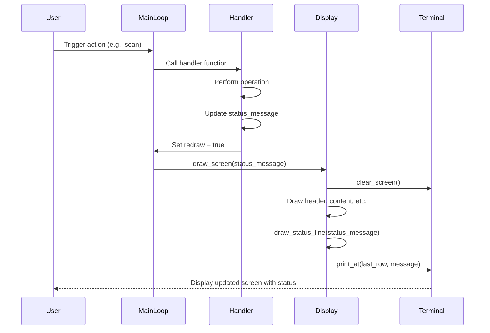

# Design Document

## Overview

This design document outlines the implementation of a persistent status line at the bottom of the terminal. The status line provides real-time feedback to users about application operations such as scanning, video playback, and database operations. The key challenge is maintaining the status message across screen redraws while ensuring the main content area doesn't overwrite it.

## Architecture

### Current Architecture

The current system has the following characteristics:

- **Screen Rendering**: `draw_screen()` in `display.rs` clears the entire screen and redraws all content
- **Status Messages**: `load_videos()` function exists but its messages are immediately cleared by subsequent `draw_screen()` calls
- **Layout Constants**: `HEADER_SIZE` and `FOOTER_SIZE` constants define reserved areas
- **Terminal Management**: `terminal.rs` provides low-level terminal operations

**Problems with Current Architecture:**
1. `clear_screen()` wipes out status messages immediately after they're displayed
2. No centralized state management for the current status message
3. Status messages are displayed but not preserved across redraws
4. `load_videos()` is called but its output is lost

### New Architecture

The new system will have these characteristics:

- **Status State**: Centralized status message stored in application state
- **Preserved Rendering**: `draw_screen()` redraws the status line at the end of each render
- **Status API**: Simple functions to set/get/clear status messages
- **Protected Area**: Status line is explicitly excluded from content area calculations

**Benefits of New Architecture:**
1. Status messages persist across redraws
2. Single source of truth for current status
3. Easy to update status from any part of the application
4. Clean separation between content area and status line

## Components and Interfaces

### 1. Application State (src/main.rs)

**Changes Required:**

Add a status message field to the main loop state:

```rust
fn main_loop(...) -> io::Result<()> {
    // ... existing state variables ...
    
    let mut status_message: String = String::new();
    
    // ... rest of main loop ...
}
```

**Status Message Management:**

The status message will be passed to `draw_screen()` and updated by various operations:

```rust
// Setting status during scan
status_message = "Scanning...".to_string();
*redraw = true;

// Setting status after scan
status_message = format!("Scanning complete ({} videos)", count);
*redraw = true;

// Setting status when playing video
status_message = format!("Playing video: {}", episode_name);
*redraw = true;
```

### 2. Display Module (src/display.rs)

**Changes Required:**

**Update draw_screen signature:**

```rust
pub fn draw_screen(
    // ... existing parameters ...
    status_message: &str,  // NEW: Current status message to display
) -> io::Result<()> {
    clear_screen()?;
    hide_cursor()?;
    
    // ... existing drawing code ...
    
    // NEW: Draw status line at the end
    draw_status_line(status_message)?;
    
    Ok(())
}
```

**New Function: draw_status_line**

```rust
/// Draw the status line at the bottom of the terminal
/// 
/// # Arguments
/// * `message` - The status message to display
/// 
/// # Returns
/// * `io::Result<()>` - Ok if successful, error otherwise
fn draw_status_line(message: &str) -> io::Result<()> {
    let (cols, rows) = get_terminal_size()?;
    let status_row = rows - 1; // Last row (0-indexed)
    
    // Clear the status line
    clear_line(status_row)?;
    
    // Truncate message if it's too long for the terminal width
    let truncated_message = if message.len() > cols {
        &message[..cols]
    } else {
        message
    };
    
    // Display the message
    if !truncated_message.is_empty() {
        print_at(0, status_row, truncated_message)?;
    }
    
    Ok(())
}
```

**Update get_max_displayed_items:**

The function already accounts for `FOOTER_SIZE`, so no changes needed. Just verify it's working correctly:

```rust
pub fn get_max_displayed_items() -> io::Result<usize> {
    let (_, rows) = get_terminal_size()?;
    let max_lines = rows - HEADER_SIZE - FOOTER_SIZE - 1;
    Ok(max_lines)
}
```

**Remove or Deprecate load_videos:**

The `load_videos()` function can be removed since status messages will now be managed through the main loop state and `draw_status_line()`.

### 3. Handlers Module (src/handlers.rs)

**Changes Required:**

Update all handler functions to accept and update the status message:

**handle_entry_mode:**

```rust
pub fn handle_entry_mode(
    // ... existing parameters ...
    status_message: &mut String,  // NEW
) {
    match code {
        KeyCode::Enter => {
            // ... validation code ...
            
            if db_exists {
                *status_message = format!("Connected to existing database at {}", db_path.display());
            } else {
                *status_message = "Creating new database...".to_string();
            }
            *redraw = true;
            
            // ... database initialization ...
            
            // Update status for scanning
            *status_message = format!("Scanning {}...", canonical_path.display());
            *redraw = true;
            
            // ... perform scan ...
            
            // Update status after scan
            if db_exists {
                if imported_count > 0 {
                    *status_message = format!("Connected to existing database. Found {} new videos", imported_count);
                } else {
                    *status_message = format!("Connected to existing database at {}", db_path.display());
                }
            } else {
                *status_message = format!("Created new database and imported {} videos", imported_count);
            }
            *redraw = true;
        }
        // ... other cases ...
    }
}
```

**handle_browse_mode:**

```rust
pub fn handle_browse_mode(
    // ... existing parameters ...
    status_message: &mut String,  // NEW
) -> io::Result<bool> {
    match code {
        KeyCode::Enter => {
            match selected_entry {
                Entry::Episode { name, episode_id, .. } => {
                    // Set status when playing video
                    *status_message = format!("Playing video: {}", name);
                    *redraw = true;
                    
                    // ... launch video player ...
                    
                    // Clear status when video player closes
                    // (This happens in the thread that waits for the player)
                }
                // ... other cases ...
            }
        }
        // ... other cases ...
    }
    Ok(true)
}
```

**Rescan Handler (in execute_menu_action):**

```rust
MenuAction::Rescan => {
    // Set scanning status
    *status_message = format!("Rescanning {}...", scan_dir.display());
    *redraw = true;
    
    // ... perform scan ...
    
    // Update status after scan
    if imported_count > 0 {
        *status_message = format!("Rescan complete. Found {} new videos", imported_count);
    } else {
        *status_message = "Rescan complete. No new videos found".to_string();
    }
    *redraw = true;
}
```

### 4. Main Module (src/main.rs)

**Changes Required:**

**Update first_run_flow:**

```rust
fn first_run_flow(
    config: &mut Config,
    config_path: &Path,
) -> io::Result<(Vec<Entry>, PathResolver, String)> {  // NEW: Return initial status message
    // ... existing code ...
    
    let status_message = if db_exists {
        if imported_count > 0 {
            format!("Connected to existing database. Found {} new videos", imported_count)
        } else {
            format!("Connected to existing database at {}", db_path.display())
        }
    } else {
        format!("Created new database and imported {} videos", imported_count)
    };
    
    Ok((entries, resolver, status_message))
}
```

**Update main function:**

```rust
fn main() -> io::Result<()> {
    // ... existing setup ...
    
    if config.is_first_run() {
        let (entries, resolver, status_message) = first_run_flow(&mut config, &app_paths.config_file)?;
        initialize_terminal()?;
        let result = main_loop(entries, config, Some(resolver), app_paths.config_file.clone(), status_message);
        restore_terminal()?;
        return result;
    }
    
    // ... existing database initialization ...
    
    let entries = get_entries().expect("Failed to get entries");
    let initial_status = String::new();  // Start with empty status
    
    initialize_terminal()?;
    let result = main_loop(entries, config, Some(resolver), app_paths.config_file, initial_status);
    restore_terminal()?;
    result
}
```

**Update main_loop signature:**

```rust
fn main_loop(
    mut entries: Vec<Entry>,
    mut config: Config,
    mut resolver: Option<PathResolver>,
    config_path: PathBuf,
    mut status_message: String,  // NEW
) -> io::Result<()> {
    // ... existing state variables ...
    
    loop {
        if redraw {
            // ... existing filtering and state update code ...
            
            draw_screen(
                &filtered_entries,
                current_item,
                &mut first_entry,
                &search,
                &config,
                &mode,
                &entry_path,
                &edit_details,
                edit_field,
                edit_cursor_pos,
                &series,
                &mut series_selection,
                &new_series,
                season_number,
                &last_action,
                &dirty_fields,
                &menu_items,
                menu_selection,
                filter_mode,
                &mut first_series,
                &view_context,
                &status_message,  // NEW
            )?;
            redraw = false;
        }
        
        // ... event handling ...
        
        match mode {
            Mode::Entry => {
                handlers::handle_entry_mode(
                    code,
                    &mut entry_path,
                    &mut entries,
                    &mut filtered_entries,
                    &mut mode,
                    &mut redraw,
                    &mut config,
                    &config_path,
                    &mut resolver,
                    &mut status_message,  // NEW
                );
            }
            Mode::Browse => {
                // ... existing code ...
                handlers::handle_browse_mode(
                    // ... existing parameters ...
                    &mut status_message,  // NEW
                )?;
            }
            // ... other modes ...
        }
    }
}
```

### 5. Video Player Status

**Changes Required:**

When launching a video player, set the status message to indicate which video is playing:

```rust
// In handle_browse_mode, when launching video player:
Entry::Episode { name, episode_id, .. } => {
    if playing_file.is_none() {
        match database::get_episode_absolute_location(*episode_id, resolver) {
            Ok(absolute_location) => {
                let mut player_process = Some(run_video_player(config, Path::new(&absolute_location))?);
                *playing_file = Some(location.to_string());
                
                // Set status message
                *status_message = format!("Playing video: {}", name);
                *redraw = true;
                
                // Spawn thread to wait for process (existing code)
                let tx_clone = tx.clone();
                thread::spawn(move || {
                    if let Some(mut process) = player_process.take() {
                        process.wait().ok();
                    }
                    tx_clone.send(()).ok();
                });
            }
            Err(e) => {
                *status_message = format!("Error: Failed to play video - {}", e);
                *redraw = true;
            }
        }
    }
}
```

**Note:** The status message will persist after the video player closes. Monitoring video player completion and clearing the status is out of scope for this feature and will be addressed in a future enhancement.

## Data Models

### Status Message State

The status message is a simple `String` stored in the main loop state:

```rust
let mut status_message: String = String::new();
```

**Status Message Lifecycle:**
1. **Empty**: Initial state, no status displayed
2. **Set**: Operation sets a message (e.g., "Scanning...")
3. **Updated**: Operation completes, message updated (e.g., "Scanning complete")
4. **Cleared**: Explicit clear or replaced by new message
5. **Preserved**: Message persists across redraws until changed

## Error Handling

### Error Scenarios

1. **Terminal Size Too Small**: If terminal height is less than minimum required (header + footer + 1 content line)
   - **Handling**: Display error message, suggest resizing terminal

2. **Status Message Too Long**: If status message exceeds terminal width
   - **Handling**: Truncate message to fit terminal width

3. **Terminal Operations Fail**: If `print_at()` or `clear_line()` fail
   - **Handling**: Propagate error up, let main error handler deal with it

### Error Messages

- **Terminal Too Small**: "Terminal too small. Please resize to at least 10 rows."
- **Display Error**: "Error updating display: {error_details}"

## Correctness Properties

*A property is a characteristic or behavior that should hold true across all valid executions of a system-essentially, a formal statement about what the system should do. Properties serve as the bridge between human-readable specifications and machine-verifiable correctness guarantees.*

### Property 1: Status message persistence across redraws

*For any* status message, after setting the message and triggering a redraw, the status line should display that message
**Validates: Requirements 1.3, 4.2**

### Property 2: Scan completion message format with count

*For any* non-negative integer count of videos, the scan completion message should include the count in the format "Scanning complete (N videos)" or "Scanning complete. No new videos found" when count is zero
**Validates: Requirements 2.3, 2.4**

### Property 3: Playing video message format

*For any* episode name, when launching a video player, the status message should be in the format "Playing video: <name>"
**Validates: Requirements 3.1**

### Property 4: Status message persistence until replaced

*For any* status message, once set, it should remain visible until explicitly replaced by a new message or cleared
**Validates: Requirements 4.1**

### Property 5: Status message persistence across mode changes

*For any* status message and any mode transition, the status message should remain unchanged unless explicitly updated
**Validates: Requirements 4.3**

### Property 6: Status message persistence across navigation

*For any* status message and any navigation action (up, down, enter, backspace), the status message should remain unchanged unless the action explicitly updates it
**Validates: Requirements 4.4**

### Property 7: Database connection message format

*For any* database path, when connecting to an existing database, the status message should include the path in the format "Connected to existing database at <path>"
**Validates: Requirements 5.1**

### Property 8: Database creation completion message format

*For any* non-negative integer count of imported videos, the database creation completion message should include the count in the format "Created new database and imported N videos"
**Validates: Requirements 5.3**

## Testing Strategy

### Unit Tests

1. **Status Line Drawing Tests**
   - Test `draw_status_line()` with various message lengths
   - Test truncation when message exceeds terminal width
   - Test empty message handling
   - Test status line positioning at different terminal sizes

2. **Message Format Tests**
   - Test scan completion message formats with different counts
   - Test playing video message format with different episode names
   - Test database connection message format with different paths
   - Test database creation message format with different counts

### Integration Tests

1. **Status Persistence Tests**
   - Set status message, trigger multiple redraws, verify message persists
   - Set status message, navigate through entries, verify message persists
   - Set status message, change modes, verify message persists
   - Set status message, perform operations, verify message updates correctly

2. **Scan Operation Tests**
   - Start scan, verify "Scanning..." appears
   - Complete scan with videos, verify count appears in message
   - Complete scan without videos, verify "No new videos" message
   - Perform rescan, verify messages update correctly

3. **Video Playback Tests**
   - Launch video, verify "Playing video: <name>" appears
   - Launch video with long name, verify truncation works

4. **Database Operation Tests**
   - Connect to existing database, verify connection message
   - Create new database, verify creation and import message
   - Perform operations after setup, verify status updates

### Manual Testing Checklist

- [ ] Status line appears at bottom of terminal
- [ ] Status messages persist across screen redraws
- [ ] Scan operations show progress messages
- [ ] Video playback shows "Playing video" message
- [ ] Database operations show appropriate messages
- [ ] Status line doesn't interfere with content area
- [ ] Long messages are truncated properly
- [ ] Terminal resize maintains status line position
- [ ] Mode changes preserve status messages
- [ ] Navigation preserves status messages

## Implementation Notes

### Threading Considerations

The video player already runs in a separate thread. This feature only adds a status message when the video starts playing. Monitoring video player completion is out of scope for this feature.

### Performance Considerations

- Drawing the status line adds minimal overhead (one `clear_line()` and one `print_at()` call per redraw)
- Status message is a simple `String`, no complex data structures needed
- No additional allocations during normal operation (message is updated in place)

### Backward Compatibility

The `load_videos()` function can be removed since it's not working correctly anyway. All existing calls to `load_videos()` should be replaced with status message updates.

### Future Enhancements

Potential future improvements:
- Status message history (view previous messages)
- Status message colors/styling for different message types
- Progress bars for long operations
- Multiple status lines for different types of information

## Diagrams

### Status Message Flow



### Status Line Layout

```
┌─────────────────────────────────────────────┐
│ Header Line 1: Mode and navigation help    │ ← HEADER_SIZE (5 lines)
│ Header Line 2: Context information         │
│ Header Line 3: Filter/search bar           │
│ Header Line 4: Column headers              │
│ Header Line 5: Separator                   │
├─────────────────────────────────────────────┤
│ Content Line 1: Entry 1                    │
│ Content Line 2: Entry 2                    │ ← Main content area
│ Content Line 3: Entry 3                    │   (calculated dynamically)
│ ...                                         │
│ Content Line N: Entry N                    │
├─────────────────────────────────────────────┤
│ Status: Scanning complete (42 videos)      │ ← FOOTER_SIZE (1 line)
└─────────────────────────────────────────────┘
```

## Design Decisions and Rationales

### Decision 1: Store Status in Main Loop State

**Decision**: Store the status message as a `String` in the main loop rather than using a global static or separate module.

**Rationale**:
- Simpler to implement and understand
- No need for thread synchronization (main loop is single-threaded)
- Easy to pass to handlers and display functions
- Follows existing pattern of storing state in main loop

**Alternatives Considered**:
- Global static with Mutex: Rejected due to unnecessary complexity
- Separate status module: Rejected as overkill for a single string
- Store in Config: Rejected as status is runtime state, not configuration

### Decision 2: Redraw Status Line on Every Screen Update

**Decision**: Call `draw_status_line()` at the end of every `draw_screen()` call.

**Rationale**:
- Ensures status is always visible after redraw
- Simple and predictable behavior
- Minimal performance overhead
- Consistent with how other UI elements are drawn

**Alternatives Considered**:
- Only draw when status changes: Rejected because `clear_screen()` wipes it anyway
- Use separate buffer for status line: Rejected as overly complex
- Don't clear status line during `clear_screen()`: Rejected as would require custom clear logic

### Decision 3: Pass Status Message Through Function Parameters

**Decision**: Pass `status_message: &mut String` to handler functions rather than returning it.

**Rationale**:
- Consistent with existing handler function signatures
- Allows handlers to update status multiple times during operation
- Clear ownership and mutation semantics
- Easy to trace status updates through code

**Alternatives Considered**:
- Return status from handlers: Rejected as handlers already return `io::Result<bool>`
- Use callback function: Rejected as unnecessarily complex
- Use event system: Rejected as overkill for this feature

### Decision 4: Status Message Persists After Video Launch

**Decision**: The "Playing video" message persists after the video player is launched and is not automatically cleared when the video finishes.

**Rationale**:
- Keeps implementation simple and focused on this feature
- Monitoring video player completion is a separate concern
- Status message will be replaced by the next operation anyway
- Future enhancement can add video player monitoring

**Alternatives Considered**:
- Clear message when video finishes: Deferred to future enhancement
- Replace with "Video finished" message: Deferred to future enhancement
- Add timestamp to message: Rejected as adds complexity without much value

### Decision 5: Truncate Long Messages

**Decision**: Truncate status messages that exceed terminal width rather than wrapping or scrolling.

**Rationale**:
- Maintains single-line status display
- Prevents status from overflowing into content area
- Simple to implement
- Most status messages are short anyway

**Alternatives Considered**:
- Wrap to multiple lines: Rejected as breaks single-line status design
- Scroll long messages: Rejected as adds complexity and animation
- Use ellipsis for truncation: Could be added later as enhancement
